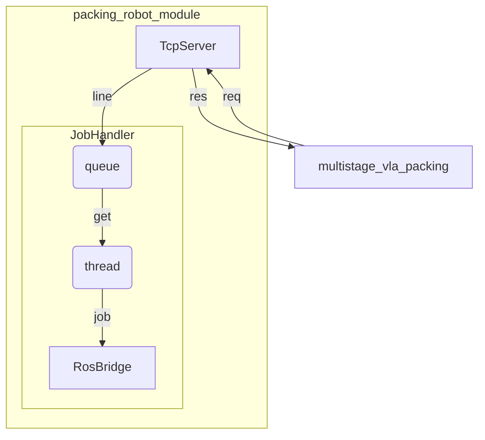
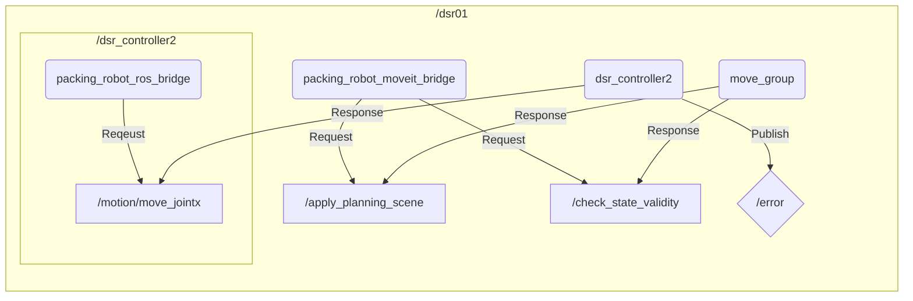

# packing_robot_module

## 실행
### Dart 시뮬레이션
```
# terminal 1
ros2 launch dsr_moveit_config_a0912 start.launch.py name:=dsr01 model:=a0912 mode:=virtual

# terminal 2
ros2 run packing_robot_module packing_robot_server
```
### 실제 로봇
```
# terminal 1
ros2 launch dsr_moveit_config_a0912 start.launch.py name:=dsr01 model:=a0912 mode:=real host:=192.168.137.123 port:=12345

# terminal 2
ros2 run packing_robot_module packing_robot_server
```

## config.yaml - collision objects 등록

`collision_objects` 하위의 각 항목은 MoveIt planning scene에 등록되는 정적 충돌체다. `frame_id` 기준 좌표계를 사용한다.

- `position_mm`: 충돌체 **중심** 좌표 `[x, y, z]` (mm)
- `size_mm`: 충돌체 전체 크기 `[가로, 세로, 높이]` (mm). 각 축 전체 길이이며 반 길이가 아니다.
- `rotation_deg`: z축 회전 (선택, 기본값 0)
- `size_mm` 값 중 0 이하가 있으면 미설정으로 간주하고 해당 충돌체 등록을 건너뛴다.


## 시스템 구성


| 클래스 | 파일 | 역할 |
|---|---|---|
| `TcpServer` | `tcp_server.py` | 클라이언트(multistage_vla_packing) 접속을 받아 `\r\n` 단위로 한 줄씩 읽고 `JobHandler.handle_line()`에 넘긴다. 한 번에 한 클라이언트만 처리하며, 연결이 끊기면 다음 접속을 다시 accept한다. |
| `JobHandler` | `job_handler.py` | 요청 JSON을 해석해 `SUBMIT_SEQUENCE`는 queue에 적재하고 즉시 queued ACK를 보낸다. 워커 thread가 queue에서 시퀀스를 하나씩 꺼내 step별 pick and place를 순차 실행하고, 완료 후 home으로 복귀한다. `GET_SEQUENCE_STATUS`에는 job/step 상태를 응답한다. |
| `RosBridge` | `ros_bridge.py` | 두산 DSR_ROBOT2 API(`movej`, `movel`, `movejx`, `ikin`/`fkin`, `set_digital_output` 등)로 실제 모션과 그리퍼를 실행한다. 실행 전 MoveIt planning scene으로 경로 충돌 여부를 검사하고, `movejx`는 도달 가능하고 충돌 없는 solution space를 찾아 이동한다. |


## ROS2 구성


| 노드 | namespace | 역할 |
|---|---|---|
| `packing_robot_ros_bridge` | `/dsr01/dsr_controller2` | DSR_ROBOT2 API가 바인딩되는 노드. `dsr_controller2`의 서비스(`/motion/move_jointx` 등 모션, ikin/fkin, 로봇 모드 설정, 디지털 출력)를 호출해 로봇 모션과 그리퍼를 실제로 실행한다. |
| `packing_robot_moveit_bridge` | `/dsr01` | MoveIt `move_group`에 요청만 보내는 노드. `/apply_planning_scene`으로 config.yaml의 정적 collision object를 등록하고, `/check_state_validity`로 후보 관절각의 충돌 여부를 확인한다. 모션 실행에는 관여하지 않는다. |

서비스 매칭은 전체 이름으로만 이뤄지지만, 클라이언트의 상대 이름은 노드 namespace 기준으로 풀린다. DSR_ROBOT2는 서비스 클라이언트를 prefix 없는 상대 이름(`motion/move_jointx` 등)으로 하드코딩하고 있어서(`DSR_ROBOT2.py`의 `_srv_name_prefix = ''`), `/dsr01/dsr_controller2/...` 서비스에 닿으려면 노드 namespace가 `/dsr01/dsr_controller2`여야 한다. 같은 노드에서 MoveIt 클라이언트를 상대 이름으로 만들면 존재하지 않는 `/dsr01/dsr_controller2/apply_planning_scene`으로 풀린다. 그래서 MoveIt 클라이언트는 `/dsr01` namespace의 별도 노드에 두었다. MoveIt 클라이언트에 절대 이름(`/dsr01/apply_planning_scene`)을 쓰면 노드 하나로도 구성할 수 있다.
